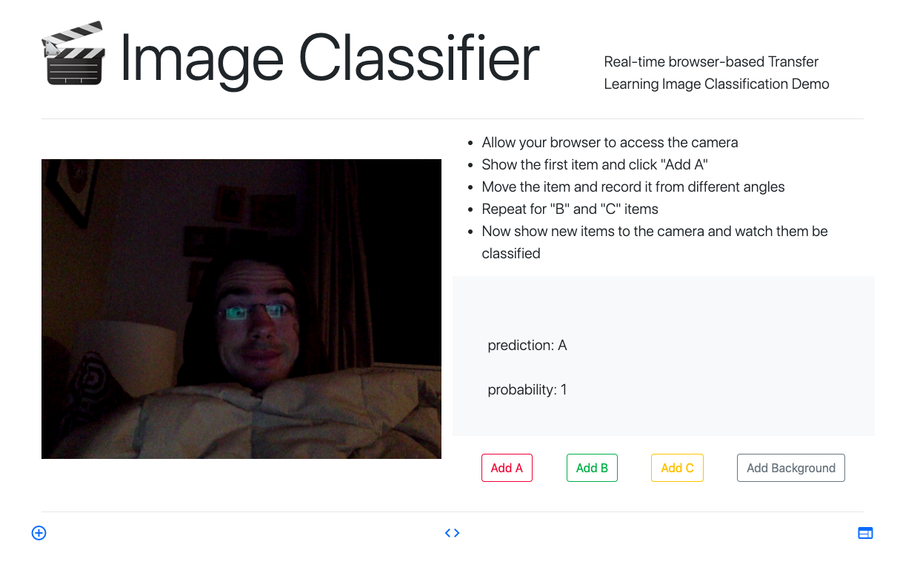

# Image Classifier

Real-time browser-based Transfer Learning Image Classification Demo

* Allow your browser to access the camera
* Show the first item and click "Add A"
* Move the item and record it from different angles
* Repeat for "B" and "C" items
* Now show new items to the camera and watch them be classified

